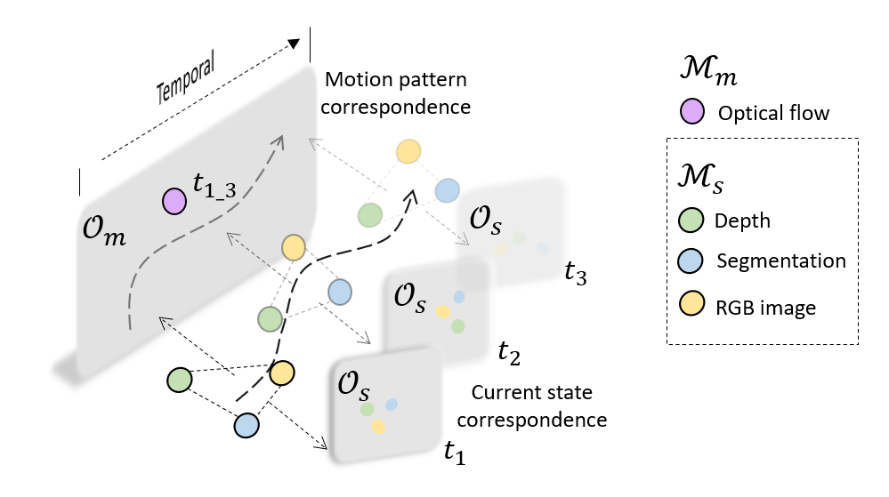
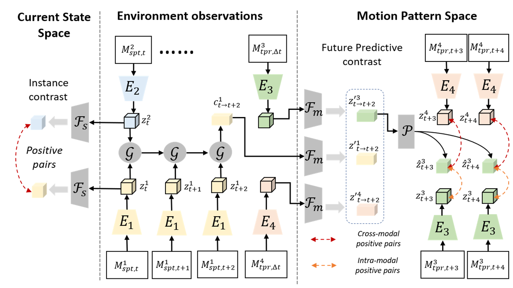

# COMPASS: COntrastive Multimodal Pretraining for AutonomouS Systems

This repository contains the PyTorch implementation of the COMPASS model proposed in our
paper 

[COMPASS: Contrastive Multimodal Pretraining for Autonomous Systems](https://www.microsoft.com/en-us/research/uploads/prod/2022/02/COMPASS.pdf).<br>
_Shuang Ma, Sai Vemprala, Wenshan Wang, Jayesh K. Gupta, Yale Song, Daniel McDuff, Ashish Kapoor_, 2022.

Please visit our blogpost for a summary on the idea and approach!

COMPASS aims to build general purpose representations for autonomous systems from multimodal observations. Given multimodal signals of spatial and temporal modalities M_s and M_m, respectively. COMPASS learns two factorized latent spaces, i.e., a motion pattern space O_m and a current state space O_s, using multimodal correspondence as the self-supervisory signal. 



## License and Citation:

This project is licensed under the terms of the MIT license. By using the software, you are agreeing to the terms of the [license agreement](LICENSE).
If you use this code in your research, please cite our work as follows:

```bibtex
@article{ma2022compass,
      title={COMPASS: Contrastive Multimodal Pretraining for Autonomous Systems}, 
      author={Shuang Ma, Sai Vemprala, Wenshan Wang, Jayesh K. Gupta, Yale Song, Daniel McDuff, Ashish Kapoor},
      year={2022},
      eprint={TBD},
      archivePrefix={arXiv},
      primaryClass={cs.CV}
}
```

## Setting up the environment:
We recommend creating a virtual environment and installing packages there. 

To create an environment with all dependencies using [conda](https://docs.conda.io/projects/conda/en/latest/user-guide/install/index.html):
```
conda env create -f conda_env.yml
```

## Pretraining

Our pretraining pipeline can be visualized through the following image. Code for pretraining is coming soon. 



## Evaluate pretrained model
In this work, we evaluate the pretrained COMPASS on three downstream tasks, i.e. "Drone Navigation",  "Car Racing" and "Visual Odometry (VO)". Please see more details under "Downstream Tasks".

To evaluate the pretrained COMPASS on downstream tasks:
* Download the dataset corresponding to the chosen downstream task. 

    _Car Racing_: https://compassrelease.blob.core.windows.net/data/car-dataset/ <br>
    _Visual Odometry_: https://compassrelease.blob.core.windows.net/data/kitti_flow/ <br>
    _Drone Navigation_: https://compassrelease.blob.core.windows.net/data/drone_datasets/ <br>

* Download the pretrained COMPASS model from [this link](https://compassrelease.blob.core.windows.net/checkpoints/new-checkpoint.pth.tar). 
* Follow the finetuning instructions from the downstream task. 


## Downstream tasks

### Drone Navigation 
For task of drone navigation, the model is expected to generate appropriate velocity commands for a quadrotor drone flying through a series of gates in simulation. We finetune our model on a dataset of drone racing gates, which has gates in varying shapes, colors and textures. For more details, please go [here](./drone-navigation)

### Car Racing
For task of car racing, the model is expected to generate appropriate steering angle commands for an autonomous car driving through a simulated racetrack environment. We finetune our model on a dataset of such a car racing track in varying environmental conditions. For more details, please go [here](./car-racing)

Both the drone navigation and car racing datasets were generated using [Microsoft AirSim](https://github.com/microsoft/AirSim).

### Visual Odometry
For task of VO, we finetune our model on the public benchmark KITTI to predict camera rotation and translation given successive frames. For more details, please go [here](./vo)

## Contributing

This project welcomes contributions and suggestions.  Most contributions require you to agree to a
Contributor License Agreement (CLA) declaring that you have the right to, and actually do, grant us
the rights to use your contribution. For details, visit https://cla.opensource.microsoft.com.

When you submit a pull request, a CLA bot will automatically determine whether you need to provide
a CLA and decorate the PR appropriately (e.g., status check, comment). Simply follow the instructions
provided by the bot. You will only need to do this once across all repos using our CLA.

This project has adopted the [Microsoft Open Source Code of Conduct](https://opensource.microsoft.com/codeofconduct/).
For more information see the [Code of Conduct FAQ](https://opensource.microsoft.com/codeofconduct/faq/) or
contact [opencode@microsoft.com](mailto:opencode@microsoft.com) with any additional questions or comments.

## Trademarks

This project may contain trademarks or logos for projects, products, or services. Authorized use of Microsoft 
trademarks or logos is subject to and must follow 
[Microsoft's Trademark & Brand Guidelines](https://www.microsoft.com/en-us/legal/intellectualproperty/trademarks/usage/general).
Use of Microsoft trademarks or logos in modified versions of this project must not cause confusion or imply Microsoft sponsorship.
Any use of third-party trademarks or logos are subject to those third-party's policies.

