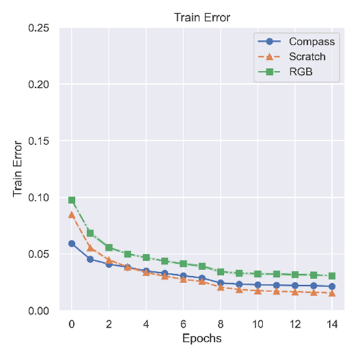
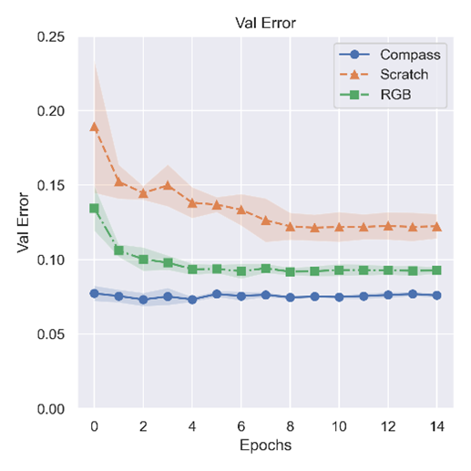

### Evaluate pretrained models

This implementation demonstrates end-to-end finetuning of a pretrained COMPASS on the car racing task, i.e given RGB image as input, the model is expected to output a steering angle for a car. The environment consists of several race tracks, where obstacles are set up to indicate the bounds of the racetrack. The steering angle command is expected to allow the car to navigate safely through the track. Some data samples from this car racing dataset can be seen below.


Please download the car racing dataset from the following link and ensure it is in the folder `car-dataset`. We recommend using [azcopy](https://docs.microsoft.com/en-us/azure/storage/common/storage-use-azcopy-v10) to download these files from Azure storage.  

Car racing dataset: https://compassrelease.blob.core.windows.net/data/car-dataset/

The architecture of this model as a combination of a COMPASS encoder and a steering angle prediction head is illustrated below.


To finetune the pretrained model for car racing, run:
```
export COMPASS_CKPT=<path to downloaded pretrained model>
python main_steering.py --gpu 0 --output_dir ./output --arch compass \
                    --data_type video --clip_len 2 \
                    --train_ann_file_name 9tracks_t80v20_train_ann.json \
                    --val_ann_file_name 9tracks_t80v20_val_ann.json \
                    --lr 1e-4 --scheduler MultiStepLR --disable_random_resize_crop \
                    --linear_prob --seed 1 --zip_file_name 9tracks.zip -j 0 \
                    --epochs 16 --use_gru --pretrained_encoder_path $COMPASS_CKPT

```

You can compare against training from scratch with:
```
python main_steering.py --gpu 0 --output_dir ./output --arch compass \
                    --data_type video --clip_len 2 \
                    --train_ann_file_name 9tracks_t80v20_train_ann.json \
                    --val_ann_file_name 9tracks_t80v20_val_ann.json \
                    --lr 1e-4 --scheduler MultiStepLR --disable_random_resize_crop \
                    --linear_prob --seed 1 --zip_file_name 9tracks.zip -j 0 \
                    --epochs 16 --use_gru --pretrained_encoder_path ''
```

 
