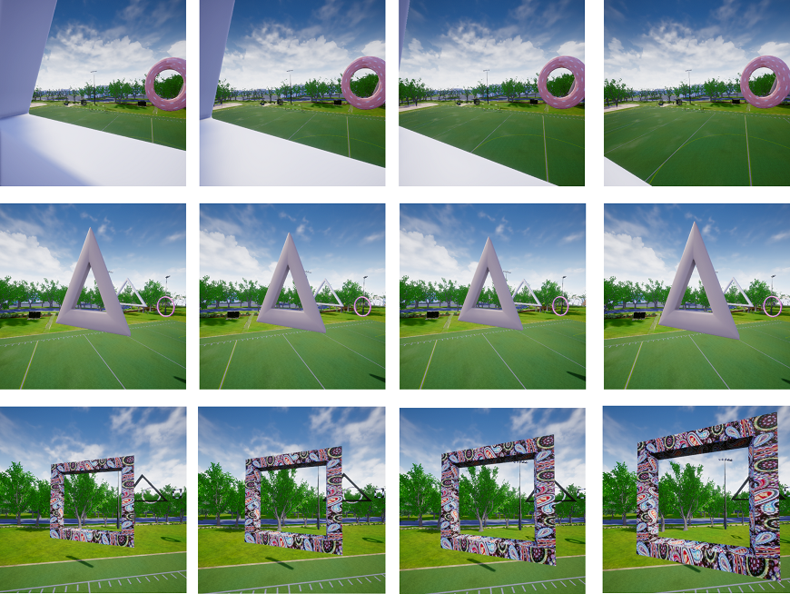
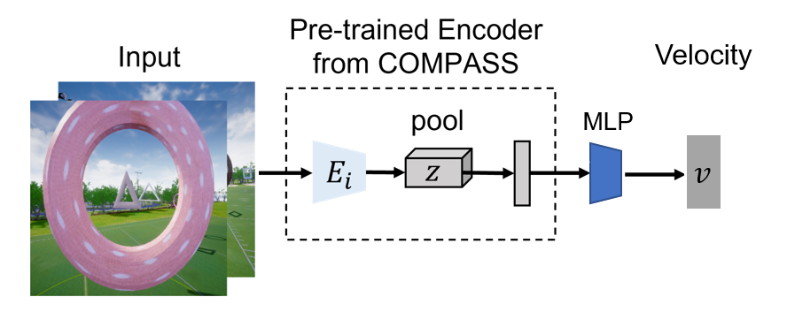
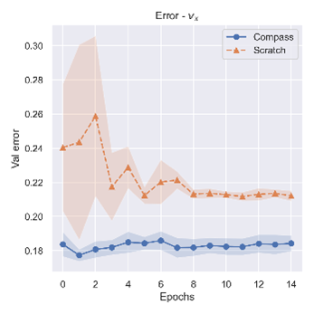
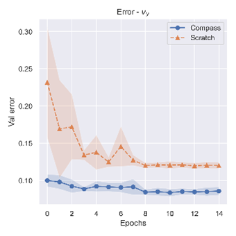
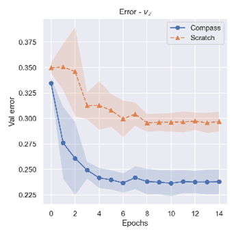
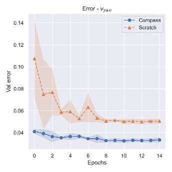

### Evaluate pretrained models
This implementation demonstrates end-to-end finetuning of a pretrained COMPASS on the drone navigation task, i.e given RGB image as input, the model is expected to output a velocity command. The environment consists of a set of gates with diverse appearances, the velocity command is expected to allow the drone navigate safely through the gates. 
Some data samples from this _"diverse gate"_ dataset for the drone navigation task can be seen below.



The architecture of this model as a combination of a COMPASS encoder and a velocity prediction head is illustrated below.



Please download the drone gate dataset from the following link and place it in `data`. We recommend using [azcopy](https://docs.microsoft.com/en-us/azure/storage/common/storage-use-azcopy-v10) to download these files from Azure storage.  

Drone gate dataset: https://compassrelease.blob.core.windows.net/data/drone_datasets/
`azcopy` command: `azcopy copy https://compassrelease.blob.core.windows.net/data/drone_datasets/ ./data/ --recursive`

To finetune the pretrained model for drone navigation, run:
```
export COMPASS_CKPT=<path to downloaded pretrained model>
python main_velocity.py --gpu 0 --output_dir ./output --arch compass \
                --data_type video --clip_len 3 \
                --train_ann_file_name custom_datagen_t80v20_train_ann.json \
                --val_ann_file_name custom_datagen_t80v20_val_ann.json \
                --lr 1e-4 --scheduler MultiStepLR --disable_random_resize_crop \
                --dataset_dir ./data/drone_datasets --linear_prob --seed 1 \
                --pretrained_encoder_path $COMPASS_CKPT
```

You can compare against training from scratch with:
```
python main_velocity.py --gpu 0 --output_dir ./output --arch compass \
                --data_type video --clip_len 3 \
                --train_ann_file_name custom_datagen_t80v20_train_ann.json \
                --val_ann_file_name custom_datagen_t80v20_val_ann.json \
                --lr 1e-4 --scheduler MultiStepLR --disable_random_resize_crop \
                --dataset_dir ./data/drone_datasets --linear_prob --seed 1 \
                --pretrained_encoder_path ''
```

   


