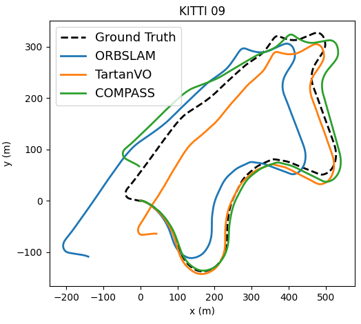
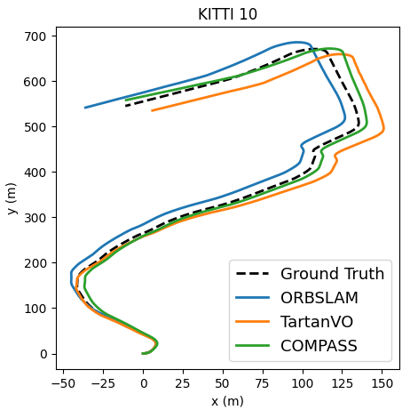

## Visual Odometry

The VO code is derived from the [TartanVO](https://github.com/castacks/tartanvo) code, where the backbone model of TartanVO is replayed by the pretrained model of COMPASS. The model is then fine-tuned on [KITTI](http://www.cvlibs.net/datasets/kitti/eval_odometry.php) 00-08, and tested on KITTI 09, 10. The testing results are shown in the following two figures. 

 
 
## Prepare the data
To accelerate the training, we first generate the optical flow images using [PWC-Net](https://github.com/NVlabs/PWC-Net/tree/master/PyTorch). And directly train the PoseNet using the flow as the input. By doing this, the training is much faster because the PoseNet is quite light-weighted compared to the whole VO model with a PWC-Net. 

You can download our pregenerated optical flow data as well as the KITTI pose data from the following links. We recommend using [azcopy](https://docs.microsoft.com/en-us/azure/storage/common/storage-use-azcopy-v10) to download these files from Azure storage.  

KITTI pose dataset: https://compassrelease.blob.core.windows.net/data/kitti
KITTI optical flow dataset: https://compassrelease.blob.core.windows.net/data/kitti_flow

After downloading the data, extract them and specify the exact location in `Datasets/data_roots.py` file. For example, if you place them in the folder `data`:
```
'kitti':        {'local':   [./data/kitti_flow, ./data/kitti_flow],
```

Download the [PWC-Net model](https://raw.githubusercontent.com/NVlabs/PWC-Net/master/PyTorch/pwc_net.pth.tar) and the COMPASS checkpoint, and put them both in the `models` folder. 

## Fine-tune the model on KITTI
The fine-tuning process takes about 3 hours on one NVIDIA 1080 node.  
```
python3 train_vo_wf.py  --exp-prefix 1_1_ --use-int-plotter --print-interval 10 --platform local \
                        --train-step 30000 --snapshot 5000 --batch-size 64 --worker-num 8  --lr 0.0002 --lr-decay \
                        --train-vo --fix-flow --vo-gt-flow 1.0 --data-file data/kitti/kitti_flow.txt --train-data-type kitti \
                        --val-file data/kitti/kitti_test_flow.txt --test-data-type kitti \
                        --image-height 448 --image-width 640  --normalize-output 0.05 --downscale-flow --network 0 \
                        --random-intrinsic 0 --random-crop-center --hsv-rand 0.2 \
                        --load-flow-model --flow-model pwc_net.pth.tar --pretrain-model-name new-checkpoint.pth.tar 
```

The following testing script allows you to run the model on KITTI 09 and 10, and output the motion files and testing results to a folder called `trajtest/1_1_kitti_`. This will also output the ATE and RPE scores. Ground truth vs. predicted trajectory plots can be seen in the image `1_1_kitti_<SEQ>_flow_trajs_aligned.jpg`.
```
PREFIX=1_1_
MODELNAME=${PREFIX}vonet_30000.pkl
OURFOLDER=trajtest/${PREFIX}kitti_
mkdir ${OURFOLDER}

TRAJNOS="09 10"
for TRAJNO in $TRAJNOS
do
    python3 train_vo_wf.py  --exp-prefix test_${PREFIX}  --test --test-num 10000 --use-int-plotter --print-interval 10 \
                            --test-traj --batch-size 1 --worker-num 0 \
                            --val-file data/kitti/kitti_${TRAJNO}_flow.txt --test-data-type kitti --gt-pose-file data/kitti/kitti_${TRAJNO}_pose_left.txt \
                            --image-width 640 --image-height 448 --normalize-output 0.05 --downscale-flow --vo-gt-flow 1.0 --fix-flow \
                            --random-intrinsic 0 --random-crop-center \
                            --load-model --model-name ${MODELNAME} --test-output-dir ${OURFOLDER} 

done
```

At last, run `plot_trajs.py` to visualize the full comparison results. Change the motion file to the file (`1_1_kitti_SEQ_flow_output_motion.txt`) you just generated during testing. 

## Optional

### Setup the environment using Docker

As the VO code can take a long time to run, we also provide a Docker image based setup that allows running the scripts on Azure/other cloud instances. To test out the Docker image locally:

1. Install docker and nvidia-docker. You can find online tutorials like [this](https://cnvrg.io/how-to-setup-docker-and-nvidia-docker-2-0-on-ubuntu-18-04/).
2. Run the docker image and mount the repository into the container, the following commands will automatically download the docker image. 
```
$ git clone [THIS-REPO]
$ cd COMPASS/vo
$ nvidia-docker run -it --rm --network host --ipc=host -v $PWD:/compass_vo saihv/compass:horovod
$ cd /compass_vo
```
You will have to change the dataset locations in `data_roots.py` accordingly.
